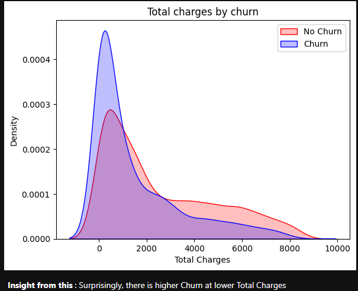
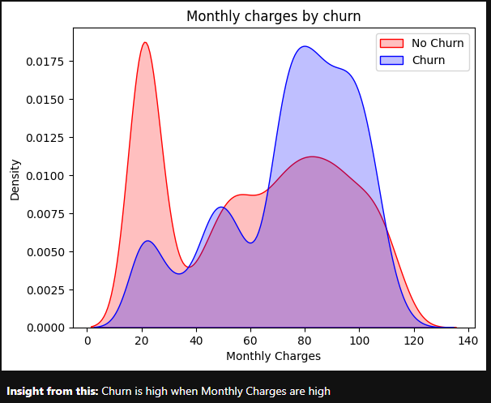
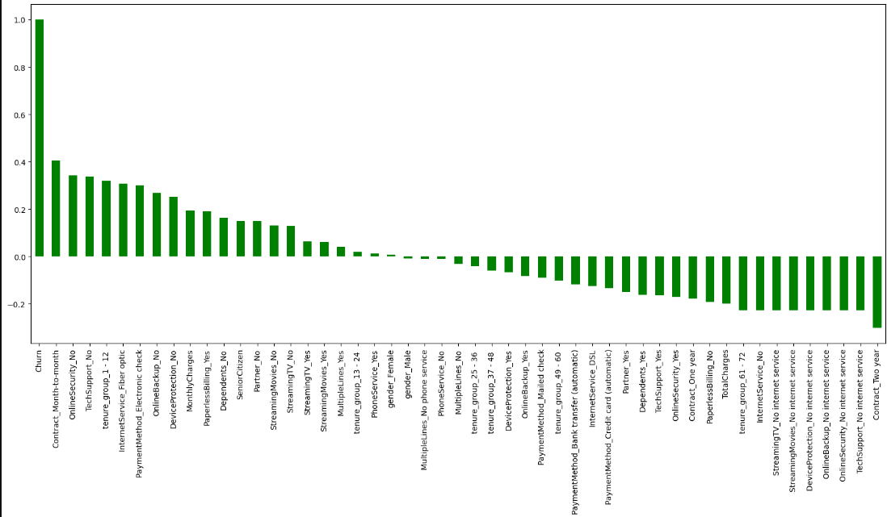
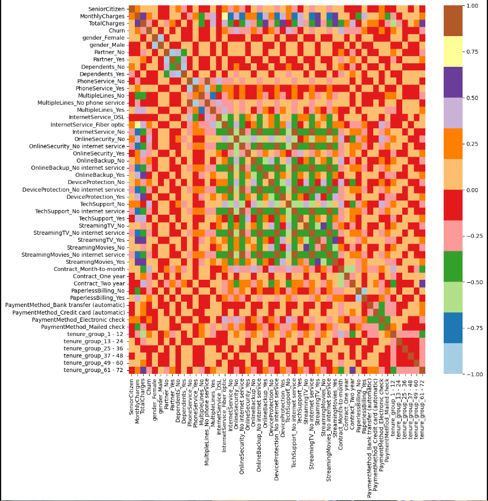
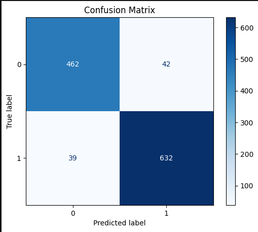
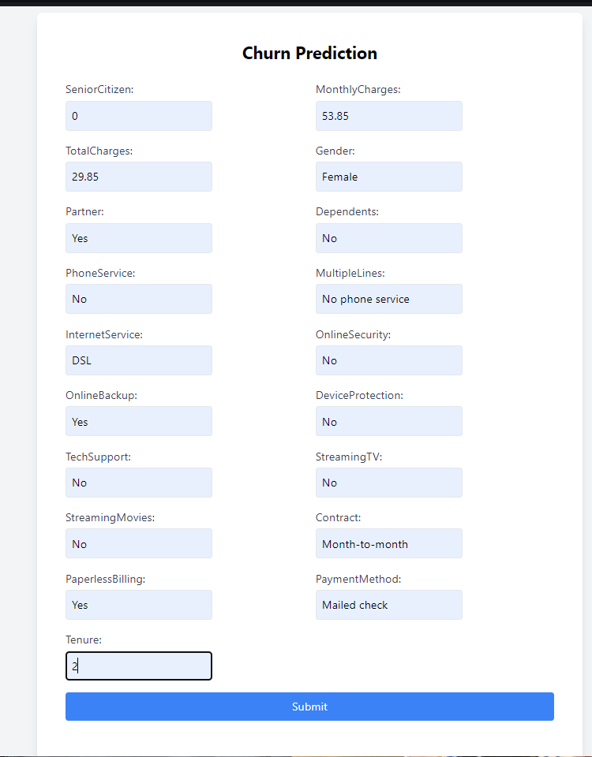
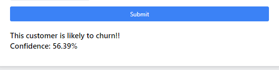

# Telco Customer Churn Prediction

This project focuses on predicting customer churn for a telecommunications company using data analysis and machine learning techniques. The project is divided into two main parts: Exploratory Data Analysis (EDA) and Model Building.

## Project Structure

- **EDA.ipynb**: Contains the exploratory data analysis of the dataset.
- **Model_Build.ipynb**: Contains the machine learning model training and evaluation.
- **app.py**: Flask application to serve the model.

## Dataset

The dataset used in this project is `Telco-Customer-Churn.csv`, which contains customer data with various attributes relevant to their service usage.

### Key Attributes

- `SeniorCitizen`: Indicates if the customer is a senior citizen.
- `MonthlyCharges`: The monthly fee for the customer.
- `TotalCharges`: The total amount charged to the customer.
- `Churn`: Indicates whether the customer has churned (Yes/No).

## Exploratory Data Analysis (EDA)

In the EDA notebook, the following tasks are performed:

1. **Data Loading and Inspection**:
    ```python
    import numpy as np
    import pandas as pd
    import seaborn as sns
    import matplotlib.pyplot as plt
    %matplotlib inline

    telco_raw_data = pd.read_csv('Telco-Customer-Churn.csv')
    telco_raw_data.head()
    ```

2. **Data Cleaning**:
    - Checking for null values and data types.
    - Converting `TotalCharges` from type object to type float.

3. **Data Visualization**:
    - Visualizing the distribution of churn.
    - Analyzing correlations between features.

### Graphs

- Distribution of Churn:
    
    

    

- Correlation of features with Churn
    
    
    
- Correlation Heatmap:
  

4. **Insights**:
    - High churn is observed among customers with higher monthly charges and lower tenure.

5. **Exporting Processed Data**:
    ```python
    telco_dummies.to_csv('telco_churn.csv')
    ```

## Model Building

In the Model Building notebook, the following steps are carried out:

1. **Loading the Processed Data**:
    ```python
    df = pd.read_csv('telco_churn.csv')
    ```

2. **Train-Test Split**:
    - Splitting the dataset into training and testing sets.

3. **Model Training**:
    - Using Decision Tree, Random Forest, and XGBoost classifiers.
    - Implementing SMOTEENN to handle class imbalance.
    ```python
    from sklearn.model_selection import train_test_split
    from sklearn.tree import DecisionTreeClassifier
    from sklearn.ensemble import RandomForestClassifier
    from imblearn.combine import SMOTEENN

    # Load data
    df = pd.read_csv('telco_churn.csv')
    
    # Create X and Y variables
    X = df.drop('Churn', axis=1)
    y = df['Churn']

    # Train-Test Split
    X_train, X_test, y_train, y_test = train_test_split(X, y, test_size=0.2)

    # Decision Tree Classifier
    model_dt = DecisionTreeClassifier(criterion='gini', random_state=100, max_depth=6, min_samples_leaf=8)
    model_dt.fit(X_train, y_train)

    # Random Forest Classifier
    model_rf = RandomForestClassifier(n_estimators=100, criterion='gini', random_state=100, max_depth=6, min_samples_leaf=8)
    model_rf.fit(X_train, y_train)

    # Implementing SMOTEENN
    sm = SMOTEENN()
    X_resampled, y_resampled = sm.fit_resample(X, y)
    ```

4. **Model Evaluation**:
    - Evaluating the model performance using precision, recall, and F1 score.

### Graphs

- Confusion Matrix for Random Forest:
  
  

5. **Model Saving**:
    ```python
    import pickle
    filename = 'model_new.sav'
    pickle.dump(model_rf, open(filename, 'wb'))
    ```

## Flask Application

A Flask app (`app.py`) is created to serve the model as a web application. The app provides a user interface where users can input customer attributes and receive a prediction on whether the customer is likely to churn.

### Key Features:

- Takes user input for various customer attributes.
- Predicts the likelihood of churn based on the trained model.
- Displays the prediction with confidence levels.

### Flask App

- Example of Prediction Results:
  
  

## Usage

1. Run the Flask application:
   ```bash
   python app.py
